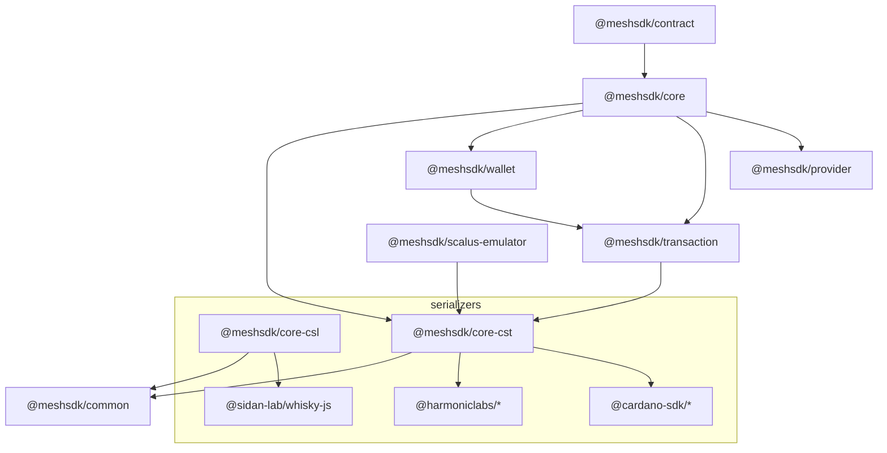

<div align="center">

  <picture>
    <source media="(prefers-color-scheme: dark)" srcset="https://meshjs.dev/logo-mesh/white/logo-mesh-white-512x512.png" width="200">
    <source media="(prefers-color-scheme: light)" srcset="https://meshjs.dev/logo-mesh/black/logo-mesh-black-512x512.png" width="200">
    
  </picture>

  <h1 style="border-bottom: none"><a href="https://meshjs.dev/">Mesh</a>: the TypeScript SDK for Cardano</h1>

[](https://github.com/MeshJS/mesh/blob/main/LICENSE.md)
[](https://github.com/meshjs/mesh/actions/workflows/build.yml)
[](https://github.com/meshjs/mesh/actions/workflows/publish.yml)
[](https://www.npmjs.com/package/@meshsdk/core)
[](https://www.npmjs.com/package/@meshsdk/core)

[](https://discord.gg/dH48jH3BKa)
[](https://x.com/meshsdk)

<strong>Build Cardano dApps in TypeScript: transactions, wallets, smart contracts and blockchain data in one open-source SDK.</strong>

[Website & live demos](https://meshjs.dev/) · [API docs](https://docs.meshjs.dev/) · [Guides](https://meshjs.dev/guides) · [Examples](https://github.com/MeshJS/examples) · [Discord](https://discord.gg/dH48jH3BKa)

</div>

<hr />

Mesh is an open-source TypeScript and JavaScript SDK for building applications on the Cardano blockchain. It handles the hard parts of Cardano development, such as coin selection, fee calculation, CBOR serialization and script evaluation, so you can focus on your app.

With Mesh you can:

- **Build transactions** with `MeshTxBuilder`: send ADA and native tokens, mint and burn NFTs, stake, vote in governance, and spend from Plutus and Aiken scripts.
- **Connect wallets** in the browser through CIP-30 (such as Eternl) with `BrowserWallet`, or sign server-side from a mnemonic or private key with `MeshWallet`.
- **Use ready-made smart contracts** for escrow, marketplaces, vesting, swaps and more, each with on-chain code and off-chain TypeScript.
- **Query and submit** through Blockfrost, Koios, Maestro, Ogmios, Yaci and other blockchain providers.
- **Test offline** against a local ledger with the Scalus emulator.

Mesh runs in Node.js, the browser, Next.js and other modern frameworks.

## Quick start

Create a new Cardano dApp from a template with the Mesh CLI:

```bash
npx meshjs your-app-name
```

Or add Mesh to an existing project:

```bash
npm install @meshsdk/core
```

### Example: send ADA from a browser wallet

```ts
import { BlockfrostProvider, BrowserWallet, MeshTxBuilder } from "@meshsdk/core";

const provider = new BlockfrostProvider("<BLOCKFROST_PROJECT_ID>");
const wallet = await BrowserWallet.enable("eternl");

const txBuilder = new MeshTxBuilder({ fetcher: provider, submitter: provider });

const unsignedTx = await txBuilder
  .txOut("addr_test1...", [{ unit: "lovelace", quantity: "5000000" }])
  .changeAddress(await wallet.getChangeAddress())
  .selectUtxosFrom(await wallet.getUtxos())
  .complete();

const signedTx = await wallet.signTx(unsignedTx);
const txHash = await provider.submitTx(signedTx);
```

Try this and many more transactions interactively in the [Mesh playground](https://meshjs.dev/apis/txbuilder).

## Packages

This monorepo publishes the core Mesh packages to npm under the `@meshsdk` scope. Most apps only need `@meshsdk/core`, which re-exports transactions, wallets, providers and common utilities.

| Package | Description | Docs |
| ------- | ----------- | ---- |
| [@meshsdk/core](https://github.com/MeshJS/mesh/tree/main/packages/mesh-core) | The main entry point. Re-exports transactions, wallets, providers and common utilities. | [Playground](https://meshjs.dev/) |
| [@meshsdk/transaction](https://github.com/MeshJS/mesh/tree/main/packages/mesh-transaction) | `MeshTxBuilder` for sending assets, minting tokens and interacting with smart contracts | [Docs](https://docs.meshjs.dev/transactions) · [Playground](https://meshjs.dev/apis/txbuilder) |
| [@meshsdk/wallet](https://github.com/MeshJS/mesh/tree/main/packages/mesh-wallet) | Browser (CIP-30) and headless wallets for managing keys, signing and submitting | [Docs](https://docs.meshjs.dev/wallets) · [Playground](https://meshjs.dev/apis/wallets) |
| [@meshsdk/contract](https://github.com/MeshJS/mesh/tree/main/packages/mesh-contract) | Open-source smart contracts with off-chain transaction code | [Docs](https://docs.meshjs.dev/contracts) · [Playground](https://meshjs.dev/smart-contracts) |
| [@meshsdk/common](https://github.com/MeshJS/mesh/tree/main/packages/mesh-common) | Shared constants, types and interfaces used across the SDK | [Docs](https://docs.meshjs.dev/common) |
| [@meshsdk/core-cst](https://github.com/MeshJS/mesh/tree/main/packages/mesh-core-cst) | Serialization and utilities built on cardano-js-sdk and Harmonic Labs libraries | [Docs](https://docs.meshjs.dev/core-cst) |
| [@meshsdk/core-csl](https://github.com/MeshJS/mesh/tree/main/packages/mesh-core-csl) | Serialization and utilities built on Whisky (cardano-serialization-lib) | [Docs](https://docs.meshjs.dev/core-csl) |
| [@meshsdk/scalus-emulator](https://github.com/MeshJS/mesh/tree/main/packages/mesh-scalus-emulator) | Local Cardano ledger emulator built on Scalus, for testing transactions offline | |

### Packages in other repositories

These `@meshsdk` packages are developed in their own repositories:

| Package | Description | Repository |
| ------- | ----------- | ---------- |
| @meshsdk/provider | Blockchain data providers (Blockfrost, Koios, Maestro, Ogmios and more) | [MeshJS/providers](https://github.com/MeshJS/providers) |
| @meshsdk/react | React components and hooks for Cardano wallet connection | [MeshJS/react](https://github.com/MeshJS/react) |
| @meshsdk/hydra | Hydra Head protocol client for layer-2 scaling | [MeshJS/hydra](https://github.com/MeshJS/hydra) |
| @meshsdk/midnight-setup | Development setup for Midnight Network dApps | [MeshJS/midnight-setup](https://github.com/MeshJS/midnight-setup) |
| @meshsdk/midnight-contracts-wizard | CLI wizard for new Midnight contract projects | [MeshJS/midnight-contracts-wizard](https://github.com/MeshJS/midnight-contracts-wizard) |

### Architecture



## Cardano smart contracts library

`@meshsdk/contract` includes open-source Cardano smart contracts, each with on-chain Aiken code, off-chain TypeScript, documentation and a live demo.

| Contract | What it does | Links |
| -------- | ------------ | ----- |
| Content Ownership | A registry where users create content that is recorded on-chain | [Demo](https://meshjs.dev/smart-contracts/content-ownership) · [Source](https://github.com/MeshJS/mesh/tree/main/packages/mesh-contract/src/content-ownership) · [Docs](https://docs.meshjs.dev/contracts/classes/MeshContentOwnershipContract) |
| Escrow | Holds assets between two parties until both agree to complete the exchange | [Demo](https://meshjs.dev/smart-contracts/escrow) · [Source](https://github.com/MeshJS/mesh/tree/main/packages/mesh-contract/src/escrow) · [Docs](https://docs.meshjs.dev/contracts/classes/MeshEscrowContract) |
| Giftcard | Locks assets behind a newly minted gift card token; redeeming burns the token and releases the assets | [Demo](https://meshjs.dev/smart-contracts/giftcard) · [Source](https://github.com/MeshJS/mesh/tree/main/packages/mesh-contract/src/giftcard) · [Docs](https://docs.meshjs.dev/contracts/classes/MeshGiftcardContract) |
| Hello World | A simple lock-and-unlock contract to learn end-to-end validation and transaction building | [Demo](https://meshjs.dev/smart-contracts/hello-world) · [Source](https://github.com/MeshJS/mesh/tree/main/packages/mesh-contract/src/hello-world) · [Docs](https://docs.meshjs.dev/contracts/classes/MeshHelloWorldContract) |
| Marketplace | An NFT marketplace where anyone can list, buy and sell native assets | [Demo](https://meshjs.dev/smart-contracts/marketplace) · [Source](https://github.com/MeshJS/mesh/tree/main/packages/mesh-contract/src/marketplace) · [Docs](https://docs.meshjs.dev/contracts/classes/MeshMarketplaceContract) |
| NFT Minting Machine | Mints NFTs with an index that increments by one for each new token | [Demo](https://meshjs.dev/smart-contracts/plutus-nft) · [Source](https://github.com/MeshJS/mesh/tree/main/packages/mesh-contract/src/plutus-nft) · [Docs](https://docs.meshjs.dev/contracts/classes/MeshPlutusNFTContract) |
| Payment Splitter | Splits incoming payments among a group of addresses | [Demo](https://meshjs.dev/smart-contracts/payment-splitter) · [Source](https://github.com/MeshJS/mesh/tree/main/packages/mesh-contract/src/payment-splitter) · [Docs](https://docs.meshjs.dev/contracts/classes/MeshPaymentSplitterContract) |
| Swap | Exchanges assets between two parties | [Demo](https://meshjs.dev/smart-contracts/swap) · [Source](https://github.com/MeshJS/mesh/tree/main/packages/mesh-contract/src/swap) · [Docs](https://docs.meshjs.dev/contracts/classes/MeshSwapContract) |
| Vesting | Locks tokens until a set time, after which the beneficiary can withdraw them | [Demo](https://meshjs.dev/smart-contracts/vesting) · [Source](https://github.com/MeshJS/mesh/tree/main/packages/mesh-contract/src/vesting) · [Docs](https://docs.meshjs.dev/contracts/classes/MeshVestingContract) |
| Asteria _(work in progress)_ | A bot challenge where ships race across a 2D grid to showcase the eUTxO model | [Source](https://github.com/MeshJS/mesh/tree/main/packages/mesh-contract/src/asteria) |
| Royalties _(work in progress)_ | CIP-102 royalties for NFTs | [Source](https://github.com/MeshJS/mesh/tree/main/packages/mesh-contract/src/royalties) · [Docs](https://docs.meshjs.dev/contracts/classes/MeshRoyaltiesContract) |

## Developing Mesh

Mesh is a Turborepo monorepo using npm workspaces. You need Node.js 18 or later.

```bash
git clone https://github.com/MeshJS/mesh.git
cd mesh
npm install
npm run build
```

| Command | What it does |
| ------- | ------------ |
| `npm run build` | Build all packages |
| `npm run dev` | Build packages in watch mode |
| `npm test` | Run the test suites |
| `npm run lint` | Lint all packages |
| `npm run format` | Check formatting with Prettier (`format:fix` to apply) |

## Contributing

Contributions of all kinds are welcome: bug fixes, new features, documentation, tests, and help triaging issues and pull requests.

- Read the [contributing guide](https://github.com/MeshJS/mesh/blob/main/CONTRIBUTING.md) and [Code of Conduct](https://github.com/MeshJS/mesh/blob/main/CODE_OF_CONDUCT.md).
- See the [developer docs](https://github.com/MeshJS/mesh/tree/main/docs) for coding and pull request guidelines.
- Report bugs and request features in [GitHub issues](https://github.com/MeshJS/mesh/issues), or ask questions on [Discord](https://discord.gg/dH48jH3BKa).

Using an AI coding assistant? [MeshJS/skills](https://github.com/MeshJS/skills) gives Claude Code, Cursor, Codex and other tools deep knowledge of the Mesh SDK.

## License

Mesh is released under the [Apache 2.0 License](https://github.com/MeshJS/mesh/blob/main/LICENSE.md).


