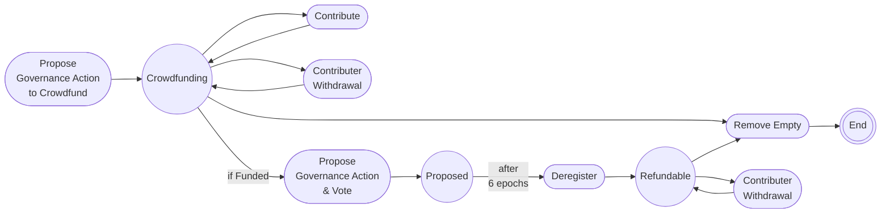

# Gov Crowdfund V2 - Scripts Overview

## Overview

The `gov-crowdfundV2` contract is a unified system that merges crowdfunding and governance functionality into a single integrated contract. This design addresses usability challenges present in the modular contract architecture.

## Scripts

### 1. gCf_spend

The spending validator that guards both crowdfunded funds and governance operations.

**Responsibilities**:
- Manages crowdfunding contributions and withdrawals
- Handles governance certificate registration/deregistration
- Validates governance proposal submission and voting
- Manages state transitions through the complete lifecycle

**Key Features**:
- Unified datum type (`CrowdfundGovDatum`) supporting both crowdfunding and governance states
- Eight distinct redeemer types covering all operations:
  1. `ContributeFund`: Add funds during crowdfunding
  2. `PreMatureContributorWithdrawal`: Withdraw funds if campaign fails/expires
  3. `PreMatureRemoveEmptyInstance`: Remove empty instance after deadline
  4. `RegisterCerts`: Register certificates and submit governance proposal
  5. `VoteOnGovAction`: Vote on governance proposal
  6. `DeregisterCerts`: Deregister certificates after governance period
  7. `AfterCompleteContributorWithdrawal`: Withdraw funds after governance completion
  8. `AfterCompleteRemoveEmptyInstance`: Remove empty instance after all funds withdrawn
- Dynamic deposit parameters (`stake_register_deposit`, `drep_register_deposit`, `gov_deposit`) to avoid hardcoding values
- Integrated validation for both crowdfunding and governance phases

**States Managed**:
- `Crowdfunding`: Active crowdfunding campaign (can transition directly to governance)
- `Proposed`: Governance proposal submitted and voted on
- `Refundable`: Post-governance state ready for contributor withdrawals

### 2. gCf_stake

The stake script validator that coordinates governance operations.

**Responsibilities**:
- Validates publishing operations (certificate registration/deregistration)
- Coordinates governance proposal submission
- Coordinates governance voting

**Key Features**:
- Publishing operations coordinated with spend validator
- Governance operations coordinated with spend validator
- No token minting/burning - `auth_token` used throughout all phases

**Integration**:
- Works in conjunction with `gCf_spend` to provide complete governance functionality
- Validates that spend validator operations are properly coordinated
- Stake validator script hash (`stake_hash`) stored in all datum states (`Crowdfund`, `Proposed`, `Voted`, `Refundable`) and used for proposal return address and DRep credential

## Contract Lifecycle

The contract follows a simplified lifecycle flow:

### Crowdfunding Phase
- **Start**: Propose Governance Action to Crowdfund (campaign initialization)
- **Crowdfunding**: Active crowdfunding state
- **Contribute**: Contributors can add funds repeatedly, looping back to crowdfunding state
- **Contributor Withdrawal**: Contributors can withdraw funds if campaign fails or expires, looping back to crowdfunding state
- **Remove Empty**: Proposer can remove empty instance (from crowdfunding or refundable state), transitioning to End
- **If Funded**: When funding target is reached, transition to governance proposal and vote (Proposed state)

### Governance Phase
- **Propose Governance Action & Vote**: When funding target is reached, register certificates, submit governance proposal, and vote on it, transitioning to Proposed state
- **Proposed**: Governance proposal has been submitted and voted on
- **After 6 Epochs**: Governance voting period completes, transitioning from Proposed to Deregister
- **Deregister**: Deregister certificates after governance period, transitioning to Refundable state

### Completion Phase
- **Refundable**: Post-governance state ready for contributor withdrawals
- **Contributor Withdrawal**: Contributors can withdraw funds by burning share tokens, looping back to Refundable state
- **Remove Empty**: Proposer can remove empty instance from Refundable state, transitioning to End state
- **End**: Final state when instance is removed

## State Transition Diagram

The diagram illustrates the simplified user-facing flow:
- **Propose Governance Action to Crowdfund**: Initial step to create and initialize the crowdfunding campaign
- **Crowdfunding**: The active phase where contributors can repeatedly contribute or withdraw funds, looping back to the crowdfunding state
- **Remove Empty**: Proposer can remove empty instances from either Crowdfunding or Refundable states, transitioning to End
- **Propose Governance Action & Vote**: When funding target is reached, governance proposal is submitted and voted on in a single transaction, transitioning to Proposed state
- **Proposed**: The governance proposal has been submitted and voted on, awaiting the governance period completion
- **Deregister**: After 6 epochs (governance voting period), certificates are deregistered, transitioning to Refundable state
- **Refundable**: Post-governance state where contributors can withdraw funds
- **Contributor Withdrawal**: Contributors can withdraw funds by burning share tokens, looping back to Refundable state until empty
- **End**: Final state when instance is removed (reached via Remove Empty action)

### gCf_spend Parameters
- `auth_token`: PolicyId for crowdfunding authentication
- `proposer_key_hash`: Authorization for instance removal
- `gov_action`: The governance action to propose
- `delegate_pool_id`: Stake pool for delegation
- `stake_register_deposit`: Dynamic stake registration deposit
- `drep_register_deposit`: Dynamic DRep registration deposit
- `gov_deposit`: Dynamic governance proposal deposit

### gCf_stake Parameters
- `auth_token`: Reference to crowdfunding token (for coordination)
- `spend`: Script hash of `gCf_spend` validator
- `gov_action_period`: Buffer period for governance operations
