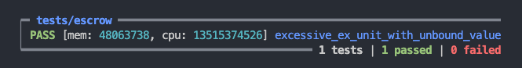

# Warning

This contract is part of the list of Bad Contracts, whose purpose is to serve as learning resources for developers, and help developers to better understand how smart contracts work and improves their ability to fix bad contracts.

- It is covered as one of the guest lectures in Gimbalabs' AikenPBL - https://www.youtube.com/watch?v=IQoN6yL3z1A

# Unbound value

## Vulnerability mechanism

Unbound value is a vulnerability where the hackers can spam the application by providing excessive unnecessary tokens in a validator, causing permanent lock of value in validator due to protocol limitation of execution units. In the escrow example, we did not specificallly guard this scenario since it did not make economical sense for both initiator and recipient to perform such hack. However, it other application or scenario it may be required to specifically check the length of input / output to prevent such hack from happening.

## Way of exploit

For the Dapp states transitioning without value length limit, hackers can always spam the utxos to make original contract initiator suffer permanent loss in locked value, in the [escrow example](./validators/escrow.ak), we didn't limit the script output value length in recipient deposit step leadingg to this vulnerability.

```rs
# No check in output value length
RecipientDeposit { recipient, recipient_assets } -> {
  expect ([input], [output]) =
    (inputs_at(inputs, own_address), outputs_at(outputs, own_address))
  // Only 1 input & output from same address
  expect InlineDatum(raw_input_datum) = input.output.datum
  expect InlineDatum(raw_output_datum) = output.datum
  expect Initiation { initiator, initiator_assets }: EscrowDatum =
    raw_input_datum
  expect output_datum: EscrowDatum = raw_output_datum
  let is_datum_updated =
    output_datum == ActiveEscrow {
      initiator,
      recipient,
      initiator_assets,
      recipient_assets,
    }
  let is_value_deposited =
    value_geq(
      output.value,
      input.output.value
        |> merge(recipient_assets |> from_asset_list()),
    )
  is_datum_updated && is_value_deposited
}
```

Test case of exploit (as shown by excessive exUnits):



## Fix the vulnerability

Fixing the vulnerability is easy by limiting state transitioning output value length, demonstrating in the [escrow contract](../aiken-workspace-v3/validators/escrow.ak)

```rs
# In scripts
// We assume each participant could only provide at max ADA + 4 diff kinds of assets
// ADA + 4(recipient) + 4(initiator)
let is_output_value_clean = value_length(output.value) <= 9
```
