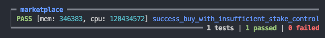

# Warning

This contract is part of the list of Bad Contracts, whose purpose is to serve as learning resources for developers, and help developers to better understand how smart contracts work and improves their ability to fix bad contracts.

- It is covered as one of the guest lectures in Gimbalabs' AikenPBL - https://www.youtube.com/watch?v=JgIhzix7rMo

# Insufficient stake control

## Vulnerability mechanism

Insufficient stake control is a vulnerability where the value payment only check against payment key but not checking with a full address. Malicious player can fulfill the validator unlocking logic by sending value to an address with his/her own stake key to steal the staking reward and voting power if the user is not aware of that.

## Way of exploit

For the contract checking value according to the pub key hash only, hackers can always send to an address composed of their stake key, in the [marketplace example](./validators/marketplace.ak), we check value with merely this function leads to the vulnerability.

```rs
# In scripts
let is_proceed_paid =
  get_all_value_to(tx.outputs, datum.seller)
    |> value_geq(
        from_lovelace(datum.price + lovelace_of(own_input.output.value)),
      )
let is_fee_paid =
  get_all_value_to_key_hash(tx.outputs, owner)
    |> value_geq(
        from_lovelace(datum.price * fee_percentage_basis_point / 10000),
      )

pub fn get_all_value_to_key_hash(
  outputs: List<Output>,
  recipient: VerificationKeyHash,
) -> Value {
  list.foldr(
    outputs,
    zero,
    fn(output, acc_value) {
      expect Some(pub_key) = address_pub_key(output.address)
      if pub_key == recipient {
        merge(acc_value, output.value)
      } else {
        acc_value
      }
    },
  )
}
```

Test case of exploit:



## Fix the vulnerability

Fixing the vulnerability is easy by changing value transfer validation from checking value to pub key to value to address like utils of `get_all_value_to`, demonstrating in the [marketplace contract](../aiken-workspace-v2/validators/marketplace.ak)

```rs
# In scripts
let is_proceed_paid =
  get_all_value_to(tx.outputs, datum.seller)
    |> value_geq(
        from_lovelace(datum.price + lovelace_of(own_input.output.value)),
      )
let is_fee_paid =
  get_all_value_to(tx.outputs, owner)
    |> value_geq(
        from_lovelace(datum.price * fee_percentage_basis_point / 10000),
      )
```
