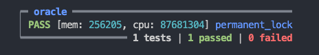

# Warning

This contract is part of the list of Bad Contracts, whose purpose is to serve as learning resources for developers, and help developers to better understand how smart contracts work and improves their ability to fix bad contracts.

- It is covered as one of the guest lectures in Gimbalabs' AikenPBL - https://www.youtube.com/watch?v=IQoN6yL3z1A

# Locked value

## Vulnerability mechanism

Locked value is a design where the application would cause permanent lock of value alike burning value permenantly. It will cause loss of fund and value circulation. However, in some scenarios it might be a intented behaviour to produce umtamperable utxos to serve as single proven source of truth for DApps. One should consider the economics and tradeoff against the design choice. In the plutus nft example, locked value vulnerability is not considered as severe since only around 2 ADA would be permenantly lock in oracle.

## Way of exploit

There is no actual way of exploit except some value is locked permanently. In the [plutus-nft example](./validators/oracle.ak), when we didn't allow shut down of oracle, it would lead to the oracle min utxos permanently locked out from Cardano circulation.

```rs
# In scrippts
// (StopOracle, [_], _) -> {
//   let is_oracle_nft_burnt =
//     only_minted_token(mint, oracle_nft_policy, "", -1)
//   let owner_key = address_payment_key(fee_address)
//   let is_owner_signed = key_signed(extra_signatories, owner_key)
//   is_oracle_nft_burnt? && is_owner_signed?
// }
```

Test case of exploit:


## Fix the vulnerability

Fixing the vulnerability is easy by limiting minting value, demonstrating in the [plutus-nft contract](../aiken-workspace/validators/oracle.ak).

```rs
# In scripts
(StopOracle, [_], _) -> {
  let is_oracle_nft_burnt =
    only_minted_token(mint, oracle_nft_policy, "", -1)
  let owner_key = address_payment_key(fee_address)
  let is_owner_signed = key_signed(extra_signatories, owner_key)
  is_oracle_nft_burnt? && is_owner_signed?
}
```
