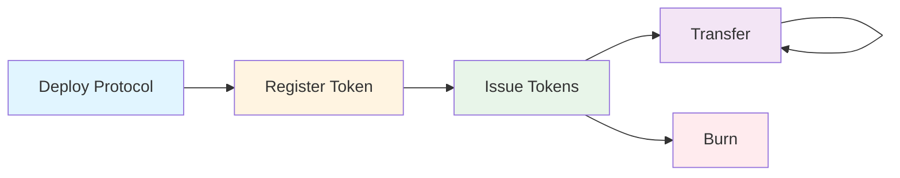
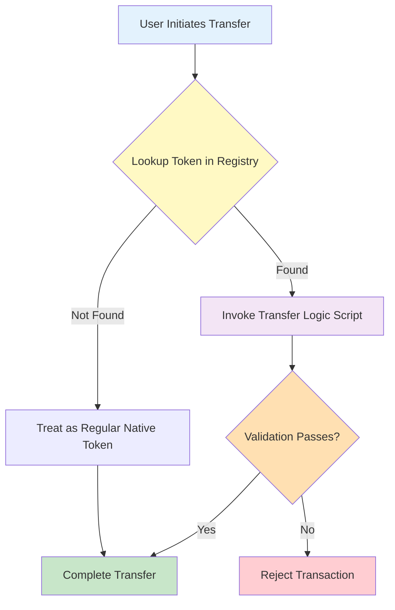

# Programmable Tokens - Aiken Implementation


**Smart contracts for CIP-113 programmable tokens on Cardano, written in Aiken.**

## Overview

This repository contains a complete Aiken implementation of CIP-113 programmable tokens - native Cardano assets enhanced with programmable transfer rules and lifecycle controls. This implementation is based on the foundational CIP-143 architecture, adapted for CIP-113 requirements. Programmable tokens enable regulatory compliance for real-world assets like stablecoins and tokenized securities while maintaining full compatibility with the Cardano native token infrastructure.

## What Are Programmable Tokens?

Programmable tokens are **native Cardano assets** with an additional layer of validation logic that executes on every transfer, mint, or burn operation. They remain fully compatible with existing Cardano infrastructure (wallets, explorers, DEXes) while adding programmable constraints required for regulated assets.

**Key principle**: All programmable tokens are locked in a shared smart contract address. Ownership is determined by stake credentials, allowing standard wallets to manage them while enabling unified validation across the entire token ecosystem.

## Key Features

- 🔐 **Permissioned Transfers** - Enforce custom validation rules on every token transfer
- 📋 **On-Chain Registry** - Decentralized directory of registered programmable tokens
- 🎯 **Composable Logic** - Plug-and-play transfer and minting validation scripts
- 🚫 **Freeze & Seize** - Optional issuer controls for regulatory compliance
- ⚡ **Constant-Time Lookups** - Sorted linked list registry enables O(1) token verification
- 🔗 **Native Asset Compatible** - Works with existing Cardano wallets and infrastructure
- 🛡️ **Multi-Layer Security** - NFT authenticity, ownership proofs, and authorization checks
- 🧩 **Extensible** - Support for blacklists, whitelists, time-locks, and custom policies

## Use Cases

- **Stablecoins** - Fiat-backed tokens with sanctions screening and freeze capabilities
- **Tokenized Securities** - Compliance with securities regulations and transfer restrictions
- **Regulated Assets** - Any token requiring KYC/AML compliance or jurisdictional controls
- **Custom Policies** - Extensible framework for any programmable token logic

## Quick Start

### Prerequisites

- [Aiken](https://aiken-lang.org/installation-instructions) v1.0.29 or higher
- [Cardano CLI](https://github.com/IntersectMBO/cardano-cli) (optional, for deployment)

### Build

```bash
cd src/programmable-tokens-onchain-aiken
aiken build
```

### Test

```bash
aiken check
```

All tests should pass:
```
    Summary 1 error(s), 89 passing (89) [89/89 checks passed]
```

### Generate Blueprints

```bash
aiken blueprint convert > plutus.json
```

## Project Structure

```
.
├── validators/          # Smart contract validators
│   ├── programmable_logic_global.ak    # Core transfer validation
│   ├── programmable_logic_base.ak      # Token custody
│   ├── registry_mint.ak                # Registry minting policy
│   ├── registry_spend.ak               # Registry spending validator
│   ├── issuance_mint.ak                # Token issuance policy
│   ├── issuance_cbor_hex_mint.ak       # CBOR hex reference NFT
│   ├── protocol_params_mint.ak         # Protocol parameters NFT
│   ├── example_transfer_logic.ak       # Example: freeze-and-seize
│   ├── blacklist_mint.ak               # Blacklist management
│   └── ...
├── lib/
│   ├── types.ak                        # Core data types
│   ├── utils.ak                        # Utility functions
│   └── linked_list.ak                  # Registry list operations
└── docs/                                # Documentation
```

## Documentation

📚 **Complete documentation is available in the [`docs/`](./docs/) directory:**

- **[Introduction](./docs/01-INTRODUCTION.md)** - Problem statement, concepts, and benefits
- **[Architecture](./docs/02-ARCHITECTURE.md)** - System design and components
- **[Validators](./docs/03-VALIDATORS.md)** - Smart contract reference
- **[Data Structures](./docs/04-DATA-STRUCTURES.md)** - Types, redeemers, and datums
- **[Transaction Flows](./docs/05-TRANSACTION-FLOWS.md)** - Building transactions
- **[Usage Guide](./docs/06-USAGE.md)** - Build, test, and deploy
- **[Migration Notes](./docs/07-MIGRATION-NOTES.md)** - Plutarch to Aiken migration


## Core Components

### 1. Token Registry (On-Chain Directory)

A sorted linked list of registered programmable tokens, implemented as on-chain UTxOs with NFT markers. Each registry entry contains:
- Token policy ID
- Transfer validation script reference
- Issuer control script reference
- Optional global state reference

### 2. Programmable Logic Base

A shared spending validator that holds all programmable tokens. All tokens share the same payment credential but have unique stake credentials for ownership.

### 3. Validation Scripts

Pluggable stake validators that define custom logic:
- **Transfer Logic** - Runs on every token transfer (e.g., blacklist checks)
- **Issuer Logic** - Controls minting, burning, and seizure operations

### 4. Minting Policies

- **Issuance Policy** - Parameterized by transfer logic, handles token minting/burning
- **Directory Policy** - Manages registry entries (one-shot for initialization)
- **Protocol Params Policy** - Stores global protocol parameters (one-shot)

## Transaction Lifecycle



1. **Deployment** - One-time setup of registry and protocol parameters
2. **Registration** - Register transfer logic and mint policy in registry
3. **Issuance** - Mint tokens with registered validation rules
4. **Transfer** - Transfer tokens with automatic validation
5. **Burn** - Burn tokens (requires issuer authorization)

## How It Works



All programmable tokens are locked at a shared smart contract address. When a transfer occurs:

1. Transaction spends token UTxO from programmable logic address
2. Global validator looks up token in on-chain registry
3. If registered, corresponding transfer logic script executes
4. Transfer succeeds only if all validation passes
5. Tokens return to programmable logic address with new stake credential

## Example: Freeze & Seize Stablecoin

This implementation includes a complete example of a regulated stablecoin with freeze and seize capabilities:

- **On-chain Blacklist** - Sorted linked list of sanctioned addresses
- **Transfer Validation** - Every transfer checks sender/recipient not blacklisted
- **Constant-Time Checks** - O(1) verification using covering node proofs
- **Issuer Controls** - Authorized parties can freeze/seize tokens

See [`validators/example_transfer_logic.ak`](./validators/example_transfer_logic.ak) for the implementation.

## Standards

This implementation is based on the foundational [CIP-143 (Interoperable Programmable Tokens)](https://cips.cardano.org/cip/CIP-0143) architecture and has been adapted for [CIP-113](https://github.com/cardano-foundation/CIPs/pull/444), which supersedes CIP-143 as a more comprehensive standard for programmable tokens on Cardano.

**Note**: CIP-113 is currently under active development. This implementation reflects the current understanding of the standard and may require updates as CIP-113 evolves.

## Development Status

**Current Status**: Research & Development

This is high-quality research and development code with the following characteristics:

- ✅ All core validators implemented with strong code quality
- ✅ Registry (directory) operations complete
- ✅ Token issuance and transfer flows working
- ✅ Freeze & seize functionality complete
- ✅ Blacklist system operational
- ✅ Good test coverage (89 passing tests)
- ✅ Tested on Preview testnet (limited scope)
- ⏳ Comprehensive testing required
- ⏳ Professional security audit pending

**Security features implemented:**
- ✅ NFT-based registry authenticity
- ✅ Ownership verification via stake credentials
- ✅ Multi-layer authorization checks
- ✅ One-shot minting policies for protocol components
- ✅ Immutable validation rules post-registration
- ✅ DDOS prevention mechanisms

## Security Considerations

⚠️ **Important**: This code has **not been professionally audited** and has only been briefly tested on Preview testnet. While code quality is high, it is **not production-ready**. Do not use with real assets or in production environments without:
- Comprehensive security audit by qualified professionals
- Extensive testing across multiple scenarios
- Thorough review by domain experts

## Migration from Plutarch

This is a complete Aiken migration of the original Plutarch implementation. Some improvements:

- **Performance** - Comparable or slightly worse
- **Error Prevention** - Target addresses are tested for staking keys 

See [Migration Notes](./docs/07-MIGRATION-NOTES.md) for detailed comparison.

## Contributing

Contributions welcome! Please:

1. Read the [documentation](./docs/) to understand the architecture
2. Ensure all tests pass (`aiken check`)
3. Add tests for new functionality
4. Follow existing code style and patterns
5. Open an issue to discuss major changes

## Testing

Run the complete test suite:

```bash
# Run all tests
aiken check

# Run specific test file
aiken check -m validators/programmable_logic_global

# Watch mode for development
aiken check --watch
```

## Related Components

- **Off-chain (Java)**: [`programmable-tokens-offchain-java/`](../programmable-tokens-offchain-java/) - Transaction building and blockchain integration

## Resources

- 📖 [Aiken Language Documentation](https://aiken-lang.org/)
- 🎓 [CIP-143 Specification](https://cips.cardano.org/cip/CIP-0143) - Original standard
- 🔄 [CIP-113 Pull Request](https://github.com/cardano-foundation/CIPs/pull/444) - Current standard development
- 🔗 [Cardano Developer Portal](https://developers.cardano.org/)
- 💬 [Aiken Discord](https://discord.gg/Vc3x8N9nz2)

## License

This project is licensed under the Apache License 2.0 - see the [LICENSE](../../LICENSE) file for details.

Copyright 2024 Cardano Foundation

## Acknowledgments

This implementation is migrated from the original Plutarch implementation developed by **Phil DiSarro** and the **IOG Team** (see [wsc-poc](https://github.com/input-output-hk/wsc-poc)). We are grateful for their foundational work on CIP-143.

Special thanks to:
- **Phil DiSarro** and the **IOG Team** for the original Plutarch design and implementation
- The **Aiken team** for the excellent smart contract language and tooling
- The **CIP-143/CIP-113 authors and contributors** for standard development
- The **Cardano developer community** for continued support and collaboration

---

**Built with ❤️ using [Aiken](https://aiken-lang.org/)**
