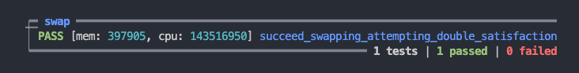

# Warning

This contract is part of the list of Bad Contracts, whose purpose is to serve as learning resources for developers, and help developers to better understand how smart contracts work and improves their ability to fix bad contracts.

- It is covered as one of the guest lectures in Gimbalabs' AikenPBL - https://www.youtube.com/watch?v=JgIhzix7rMo

# Double Satisfaction Vulnerability

## Vulnerability mechanism

This is a vulnerability where a bad actor can unlock multiple script utxos by fulfilling less than intented criteria. This swap example illustrate this vulnerability by not checking there is only 1 script input. It leads to bad actors can extract more value than it was expected from the protocol.

## Way of exploit

For the contract checking value settlement without limiting number of script utxos, hackers can always unlock multiple utxos with less needed to pay, in the [swap example](./validators/swap.ak), we didn't check number of script input leads to this vulnerability.

```rs
# Missing this line
// let is_only_one_input_from_script =
//   when inputs_from_script is {
//     [_] -> True
//     _ -> False
//   }
```

Test case of exploit:



## Fix the vulnerability

Fixing the vulnerability is easy by either properly handling multiple unlock or simply limiting single unlock at a time, the latter is demonstrated in the [swap contract](../aiken-workspace-v2/validators/swap.ak)

```rs
# In scripts
let is_only_one_input_from_script =
  when inputs_from_script is {
    [_] -> True
    _ -> False
  }
```
